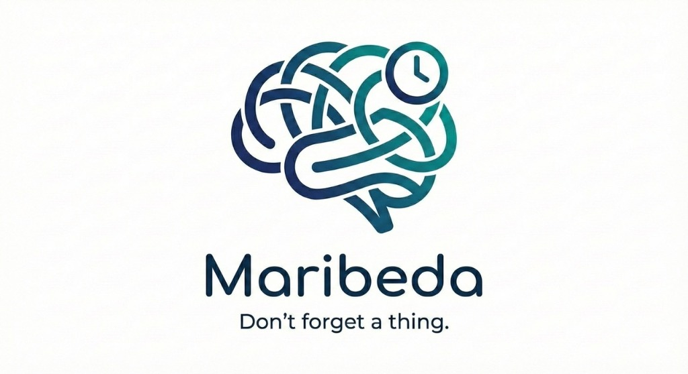

# Maribeda

**Don't forget a thing.**

## ✨ Features

- **🧠 Full-Text Search (FTS5)**: Find anything instantly. Maribeda remembers, so you don't have to.
- **⚡ Instant Capture**: Zero-friction interface. Save a thought in seconds before it slips away.
- **🛡️ Total Privacy**: No accounts, no cloud sync. Your data lives in your browser's memory.
- **💾 Portable Data**: Backup and restore your database with a single `.sqlite` file.

## 🛠 The Stack

We are pushing the boundaries of what a web app can do by running a full SQL engine in the browser.

| Layer | Technology | Why? |
| :--- | :--- | :--- |
| **Framework** | React 18 + TypeScript | Type safety and industry-standard UI. |
| **Database** | sql.js (SQLite WASM) | Enables real SQL and powerful FTS5 search directly in the browser. |
| **Styling** | Vanilla CSS | Zero dependencies, maximum control, lightweight bundle. |
| **Build** | Vite | Lightning-fast HMR and optimized production builds. |
| **Hosting** | Vercel | Global edge delivery for the static assets and WASM files. |

## 🚧 Phase 1 Status

Currently focused on core capture/retrieval and optimizing the SQLite WASM memory usage.

## Gets Started

1.  Clone the repository.
2.  Install dependencies: `npm install`
3.  Run the development server: `npm run dev`
